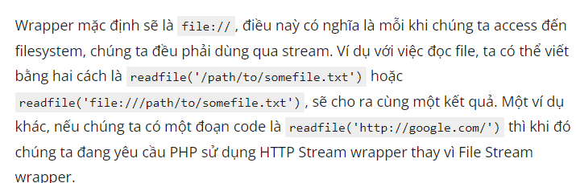
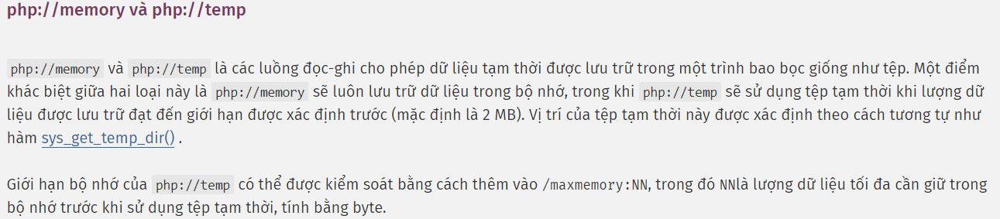
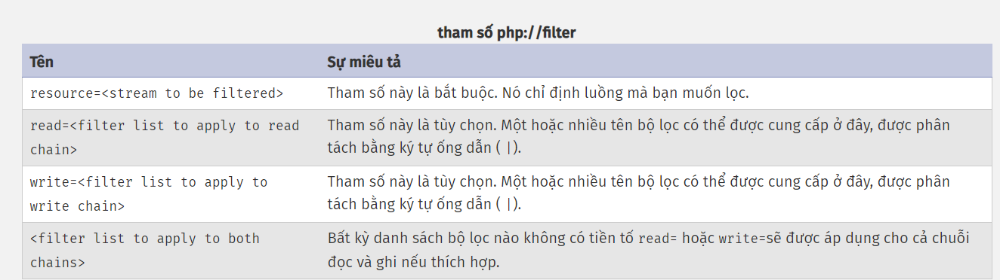
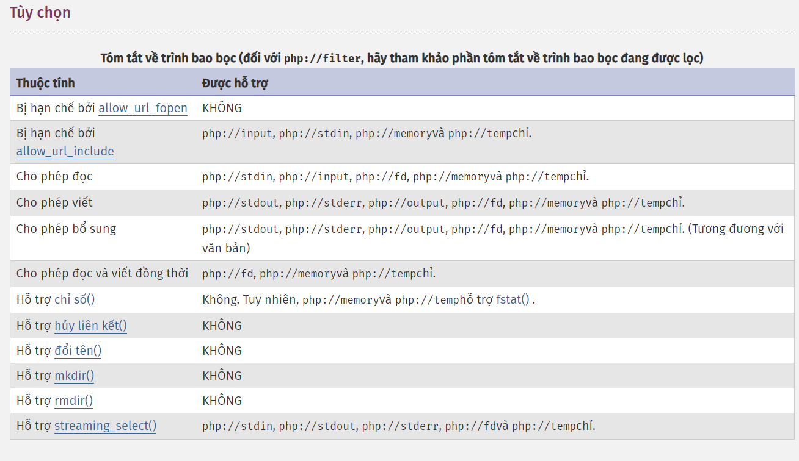

## Tìm hiểu về Streams trong PHP

- ở đây em được biết Stream là các tài nguyên được php cung cấp mà thông thường rất ít khi được biết đến thường được sử dụng trong các kỹ thuật nâng cao để tối ưu hóa hiệu năng ứng dụng của chúng ta
- trong một stream sẽ có tồn tại một implementation wrapper mà bên trong đó có tồn tại một số code bổ sung các giao thức đặc biệt hoặc thư viện giúp ích cho chúng ta trong việc encode.


## Cấu trúc của một stream cơ bản

- một stream cơ bản được tham chiếu dưới dạng <scheme>://<target> . Trong đó<scheme>là tên của wrapper và<target>` sẽ phụ thuộc vào cú pháp của wrapper.
- 


## php:// Wrapper
-Bản thân PHP cũng tự có cho riêng mình một wrapper để có thể access vào I/O streams. Một số wrapper cơ bản như: php://stdin, php://stdout, and php://stderr được map đến với các tài nguyên I/O mặc định. PHP cũng có thêm php://input là một read-only stream có thể truy cập trực tiếp đến dữ liệu raw của POST request. Điều này khá là thuận tiện khi chúng ta đang làm việc với các remote service mà payload data được đặt tại body của một POST request.
- PHP 5 .1 giới thiệu thêm các wrapper: php://memory và php://temp được sử dụng để đọc và ghi các dữ liệu tạm thời. Bản thân tên của các wrapper này cũng cho thấy rằng dữ liệu được lưu trữ tương ứng ở memory hoặc ở trong một bộ file tạm được quản lý bởi system. Ngoài ra còn có thêm php://filter, một meta-wrapper được thiết kế để có thể áp dụng các filters trong việc mở một stream với các hàm như là readfile() hoặc file_get_contents() hoặc stream_get_contents().

```
<?php
// Write encoded data
file_put_contents("php://filter/write=string.rot13/resource=file:///path/to/somefile.txt", "Hello World");

// Read data and encode/decode
readfile("php://filter/read=string.toupper|string.rot13/resource=http://www.google.com");


```
- khái niệm chính thức : PHP cung cấp một số luồng I/O linh tinh cho phép truy cập vào các luồng đầu vào và đầu ra của chính PHP, các bộ mô tả tệp đầu vào, đầu ra và lỗi tiêu chuẩn, các luồng tệp tạm thời trong bộ nhớ và được hỗ trợ trên đĩa và các bộ lọc có thể thao tác các tài nguyên tệp khác khi chúng được đọc và ghi vào.

### php://stdin, php://stdout và php://stderr 
- php://stdin , php://stdout và php://stderr cho phép truy cập trực tiếp vào luồng đầu vào hoặc đầu ra tương ứng của quy trình PHP. Luồng tham chiếu đến bộ mô tả tệp trùng lặp, vì vậy nếu bạn mở php://stdin và sau đó đóng nó, bạn chỉ đóng bản sao của bộ mô tả - luồng thực tế được tham chiếu bởi STDINkhông bị ảnh hưởng. Bạn chỉ nên sử dụng các hằng số STDINvà STDOUTthay STDERRvì mở luồng theo cách thủ công bằng cách sử dụng các trình bao bọc này.
- php://stdin là chỉ đọc, trong khi php://stdout và php://stderr là chỉ ghi.

### php://input 
- php://input là luồng chỉ đọc cho phép bạn đọc dữ liệu thô từ nội dung yêu cầu. php://input không có sẵn trong các yêu cầu POST enctype="multipart/form-data"nếu tùy chọn Enable_post_data_reading được bật.

### php://output 
- php://output là luồng chỉ ghi cho phép bạn ghi vào cơ chế bộ đệm đầu ra giống như print và echo .
### php://fd 
- php://fd cho phép truy cập trực tiếp vào bộ mô tả tệp đã cho. Ví dụ: php://fd/3 đề cập đến bộ mô tả tệp 3.



### php://filter
- php://filter là một loại trình bao bọc meta được thiết kế để cho phép áp dụng các bộ lọc vào luồng tại thời điểm mở. Điều này hữu ích với các hàm tệp tất cả trong một như readfile() , file() và file_get_contents() khi không có cơ hội áp dụng bộ lọc cho luồng trước khi nội dung được đọc.

Mục tiêu php://filter lấy các tham số sau như một phần của đường dẫn của nó. Nhiều chuỗi bộ lọc có thể được chỉ định trên một đường dẫn.


