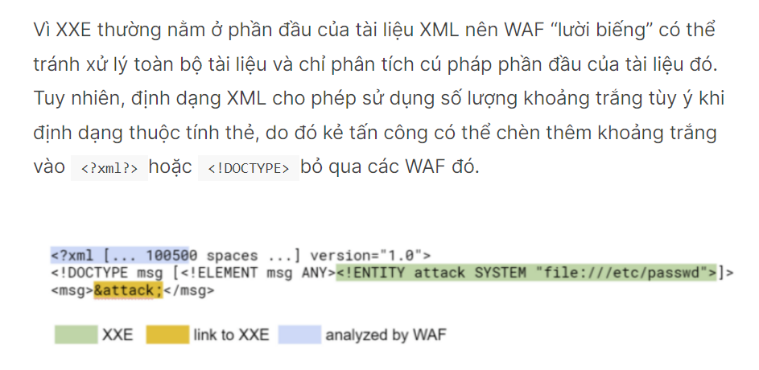
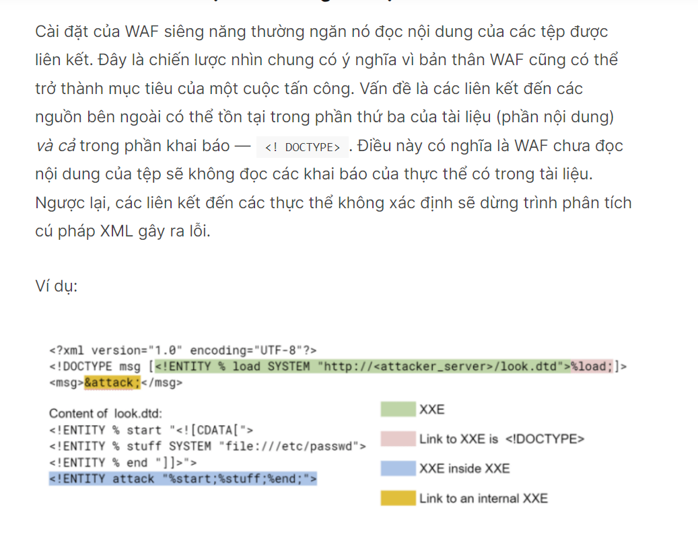
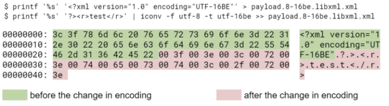
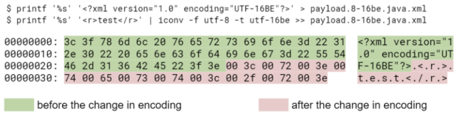
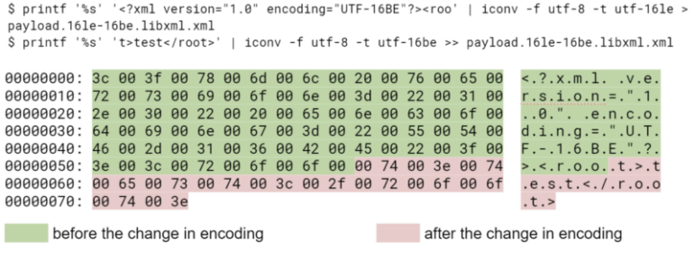
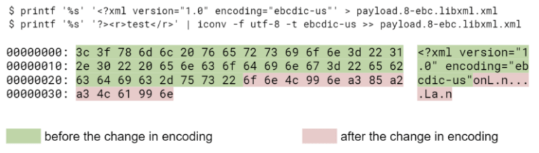
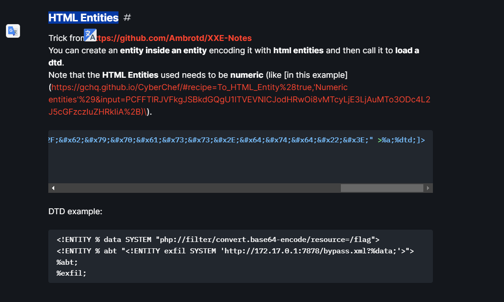
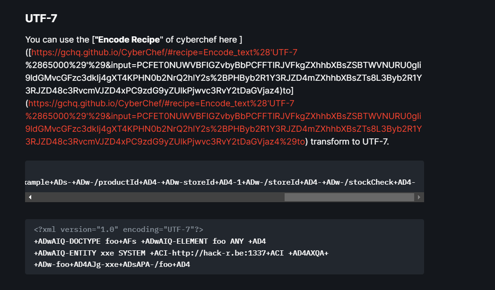
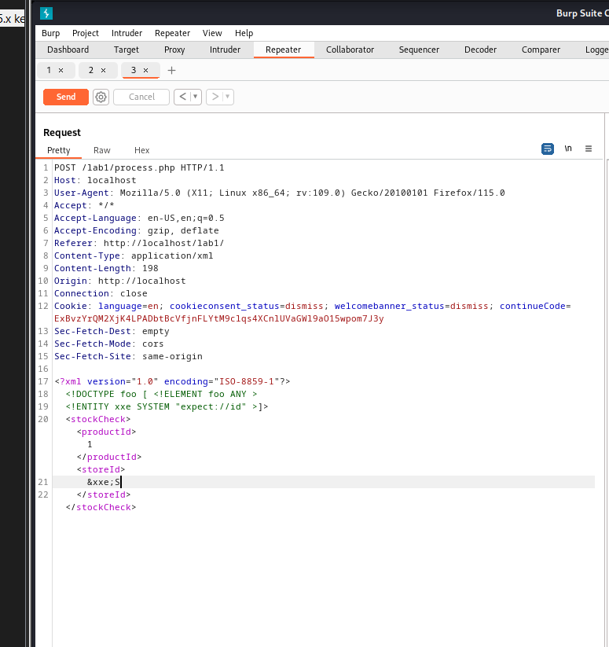

## 8 phương pháp XXE của hacker để vượt qua WAF:
+ Không gian tài liệu bổ sung
+ Định dạng không hợp lệ
+ Mã hóa kỳ lạ
+ Một tài liệu: hai loại mã hóa

- Các loại WAF XXE thường gặp:

+ Diligent WAFs :xử lý trước tài liệu XML bằng trình phân tích cú pháp riêng, như là qua 1 blacklist gì đó ạ.
+ Regex-based WAFs : chỉ tìm kiếm các chuỗi con hoặc biểu thức chính quy nhất định trong dữ liệu, là sẽ check theo cấu trúc của các thành phần nhỏ trong file xml ạ.

### Cách 0 : check xml client :3


### Cách 1 : Thêm khoảng trống trong tài liệu


- Như giải thích ở trên có thể hiểu nôm na là ta sẽ thêm khoảng trắng vào quá giới hạn checking của WAF.


### Cách 2: Định dạng không hợp lệ - NÓ CŨNG giống như kiểu bypass blacklist và phải đảm bảo đúng cú pháp ạ
+ kẻ tấn công có thể gửi các tài liệu XML được định dạng đặc biệt để WAF coi chúng không hợp lệ.


### Cách 3: Liên kết đến các thực thể không xác định
+ Loại này em có demo với error-base XXE ạ - ví dụ em sẽ load 1 file dtd ở bên ngoài và khi check WAF dẽ không phát hiện ra nội dung file dtd em cho vào 


### cách 4 : Mã hóa kỳ lạ
+ Ngoài ba phần của tài liệu XML được đề cập trước đó, còn có phần thứ tư nằm phía trên chúng, phần này cũng kiểm soát việc mã hóa tài liệu (như <?xml?>) — các byte đầu tiên của tài liệu có BOM (dấu thứ tự byte) tùy chọn.

+ Một tài liệu XML có thể được mã hóa không chỉ ở UTF-8 mà còn ở UTF-16 (hai biến thể - BE và LE), UTF-32 (bốn biến thể - BE, LE, 2143, 3412) và EBCDIC.

+ Với sự trợ giúp của các mã hóa như vậy, bạn có thể dễ dàng bỏ qua WAF bằng cách sử dụng các biểu thức chính quy vì trong loại WAF này, các biểu thức chính quy thường chỉ được định cấu hình cho một bộ ký tự.

+ Mã hóa kỳ lạ cũng có thể được sử dụng để vượt qua các WAF siêng năng vì chúng không phải lúc nào cũng có thể xử lý tất cả các mã hóa được liệt kê ở trên. Chẳng hạn, trình phân tích cú pháp libxml2 chỉ hỗ trợ một loại UTF-32 - UTF-32BE, đặc biệt là không có BOM.

ví dụ :

- Bỏ qua thông qua mã hóa ký tự
Trình phân tích cú pháp XML sử dụng 4 phương pháp để phát hiện mã hóa:

Loại nội dung HTTP: Loại nội dung: văn bản/xml; bộ ký tự=utf-8
-Đọc dấu thứ tự byte (BOM)
-Đọc ký hiệu đầu tiên của tài liệu
-UTF-8 (3C 3F 78 6D)
-UTF-16BE (00 3C 00 3F)
-UTF-16LE (3C 00 3F 00)
Khai báo XML:
- Ta có thể chuyển đổi tải trọng sang UTF-16 bằng iconv để bỏ qua một số WAF:

cat utf8exploit.xml | iconv -f UTF-8 -t UTF-16BE > utf16exploit.xml


### cách 5 : Hai kiểu mã hóa trong một tài liệu
- đoạn này em đọc không hỉu lắm ạ có vẻ như là waf sẽ check thiếu kiểu mã hóa mã ta dùng 2 loại để vượt qua ạ:<

```

Trong phần trước, chúng tôi đã chứng minh rằng mã hóa tài liệu thường được chỉ định bởi byte đầu tiên của nó. Nhưng điều gì sẽ xảy ra khi có một 
<?xml?>thẻ chứa thuộc tính mã hóa đề cập đến một bộ ký tự khác ở đầu tài liệu? Trong trường hợp này, một số trình phân tích cú pháp thay đổi cách mã hóa sao cho phần đầu của tệp có một bộ ký tự và phần còn lại ở dạng mã hóa khác. Điều đó có nghĩa là các trình phân tích cú pháp khác nhau có thể chuyển đổi mã hóa vào các thời điểm khác nhau. Trình phân tích cú pháp Java (javax.xml.parsers) thay đổi bộ ký tự một cách nghiêm ngặt sau khi <?xml?>kết thúc, trong khi trình phân tích cú pháp libxml2 có thể chuyển mã hóa ngay sau khi giá trị của thuộc tính “mã hóa” được thực thi hoặc muộn hơn - trước hoặc sau khi <?xml?>đã được xử lý.

Một WAF siêng năng chỉ có thể bảo vệ khỏi các cuộc tấn công trong các tài liệu đó một cách đáng tin cậy nếu nó không bao giờ xử lý chúng. Chúng ta cũng phải nhớ rằng có nhiều bảng mã đồng nghĩa, chẳng hạn như UTF-32BE và UCS-4BE. Hơn nữa, một số cách mã hóa có thể khác nhau nhưng tương thích với quan điểm mã hóa phần đầu của tài liệu -  <?xml?>. Ví dụ: một tài liệu có vẻ như là UTF-8 có thể chứa chuỗi <?xml version=”1.0” encoding=”windows-1251”?>.

Dưới đây là một số ví dụ. Để cho ngắn gọn, chúng tôi sẽ không đặt XXE trong tài liệu.

Ví dụ về hai loại mã hóa trong một tài liệu
Trình phân tích cú pháp libxml2 coi tài liệu là hợp lệ, tuy nhiên, công cụ Java từ bộ javax.xml.parsers coi tài liệu đó không hợp lệ:
```


```
Ngược lại, tài liệu hợp lệ về mặt trình phân tích cú pháp javax.xml.parser, nhưng không hợp lệ về mặt trình phân tích cú pháp libxml2:
```


```
Tài liệu về libxml2, mã hóa thay đổi từ utf-16le sang utf-16be ở giữa thẻ:
```


```
Tài liệu về libxml2, thay đổi mã hóa từ utf-8 sang ebcdic-us:
```




### Cách 6 : HTML Entities


### Cách 7 : UTF-7


### Cách 8 : Dùng expect:// để RCE

