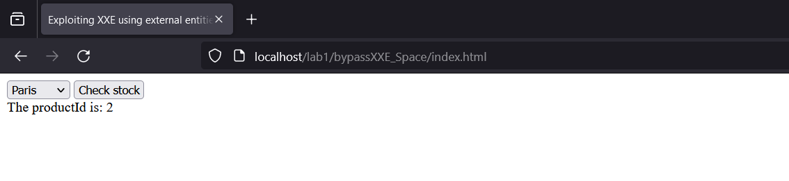
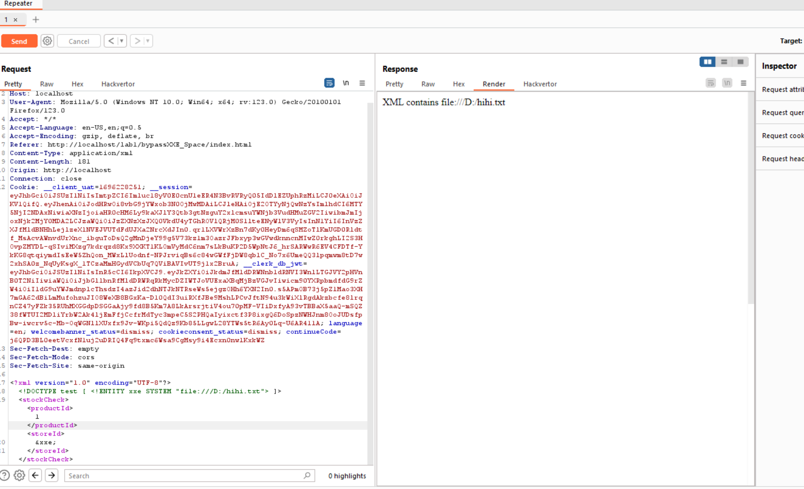
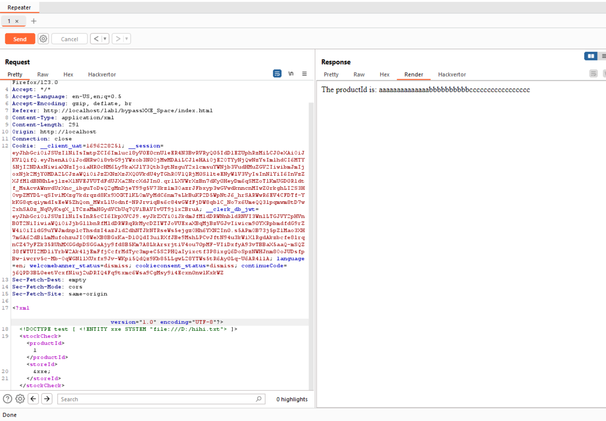

- Đoạn này em đã dùng hàm check 50 kí tự đầu nếu mà có người tác động vào thì em sẽ đánh chặn nó luôn


```
<?php
ini_set('display_errors', 1);
ini_set('display_startup_errors', 1);
error_reporting(E_ALL);

function checkXMLString($xmlString) {
    $first100Chars = substr($xmlString, 0, 100);
    if (strpos($xmlString, "file:///D:/hihi.txt") !== false) {
        return false; 
    }
    return true;
}

if ($_SERVER['REQUEST_METHOD'] === 'POST') {
    $xml = file_get_contents('php://input');
    if ($xml) {
        if (checkXMLString($xml)) {
            $data = simplexml_load_string($xml, null, LIBXML_NOENT);
            if ($data !== false) {
                $productId = $data->storeId;
                echo "The productId is: " . $productId;
            } else {
                echo "Failed to parse XML data";
            }
        } else {
            echo "XML contains file:///D:/hihi.txt";
        }
    } else {
        echo "No XML data received";
    }
} else {
    echo "Only POST requests are allowed";
}
?>


```

- Đương nhiên là mình gửi bình thường sẽ không được ạ nhưng mà bây giờ em sẽ thêm khoảng trắng vào vì nó chỉ check 100 kí tự đầu thôi ạ

- Chức năng vẫn tương tự là check productId ạ


- Em XXE đơn giản thì sever check 


- Em sử dụng dấu cách để bypass

- Vậy là em nhận được kết quả ạ:<
