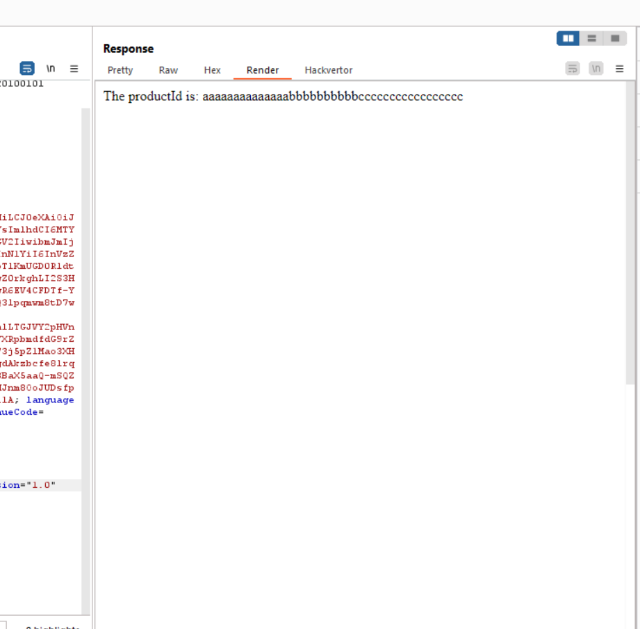

- đối với bài này sẽ check trước khi gửi xml


```
document.getElementById("checkForm").addEventListener("submit", function(e) {
                                        checkStock(this.getAttribute("method"), this.getAttribute("action"), new FormData(this));
                                        e.preventDefault();
                                    });
                                    function checkXMLString(xmlString) {
                                        if (xmlString.indexOf("file:///D:/hihi.txt") !== -1) {
                                            return false; 
                                        }
                                        return true;
                                    }
                                    
                                    
                                    function checkStock(method, path, data) {
                                        var xml = '<?xml version="1.0" encoding="UTF-8"?>';
                                        xml += '<stockCheck>';
                                    
                                        for(var pair of data.entries()) {
                                            var key = pair[0];
                                            var value = pair[1];
                                    
                                            xml += '<' + key + '>' + value + '</' + key + '>';
                                        }
                                    
                                        xml += '</stockCheck>';
                                        console.log(xml);
                                    if (checkXMLString(xml)) {

                                        fetch(
                                            path,
                                            {
                                                method: method,
                                                headers: { 'Content-Type': "application/xml" },
                                                body: xml
                                            }
                                        )
                                        .then(response => {
                                            if (!response.ok) {
                                                throw new Error('Network response was not ok');
                                            }
                                            return response.text();
                                        })
                                        .then(text => {
                                            document.getElementById("loginResult").innerHTML = text;
                                        })
                                        .catch(error => {
                                            console.error('There was a problem with the fetch operation:', error);
                                        });
                                    }
                                    else {
                                        return;
                                    }
                                    }
                                    

```

- Trước khi gửi sẽ check   function checkXMLString(xmlString) {
                                        if (xmlString.indexOf("file:///D:/hihi.txt") !== -1) {
                                            return false; 
                                        }
                                        return true;
                                    }
- nếu mà chứ file:///D:/hihi.txt thì sẽ không gửi được là cách tối nhất là bắt burpsuite và ta nhận được kết quả
