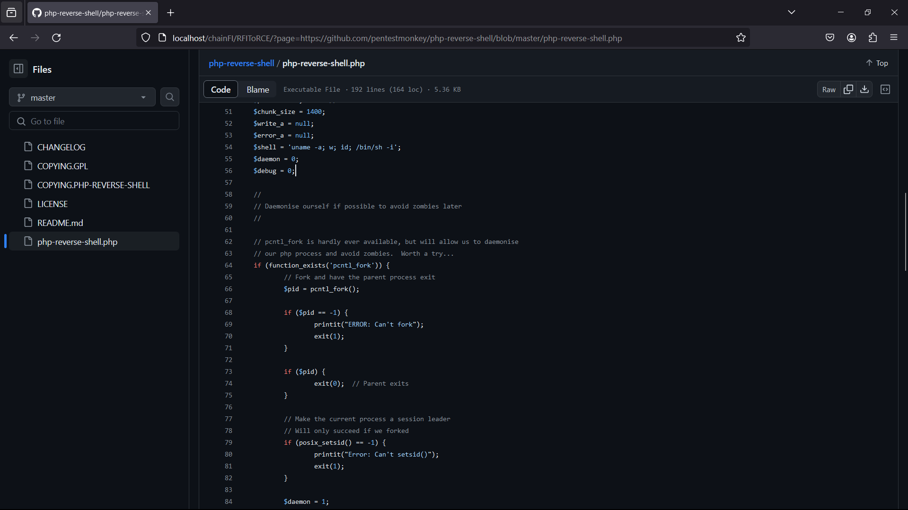
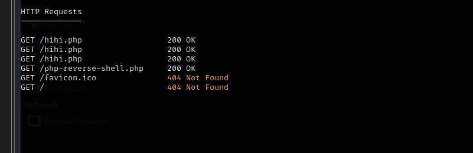

```
<?php

if (isset($_GET['page'])) {
   $page = $_GET['page'];
  include ($page);
} else {
  
 echo "No page found";
                                        
}

?>


```

- để làm được bài này bạn cần cho phép bật url open trong php.ini



- Em sẽ tạo 1 sever và nhúng vào để RCE ạ

```
<?php phpinfo();>
```

- 