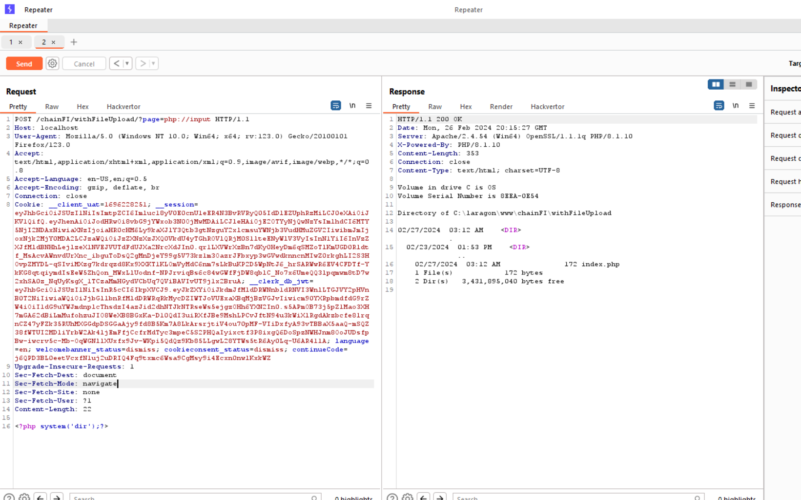

- Đây là source code của bài này ạ

```
<?php

if (isset($_GET['page'])) {
   $page = $_GET['page'];
  include ($page);
} else {
  
 echo "No page found";
                                        
}

?>

```

- Em sẽ lợi dụng php://input để include với page là shell của em
- Em đổi thành method POST và vẫn nhận parameter GET page và em đã RCE được ạ
