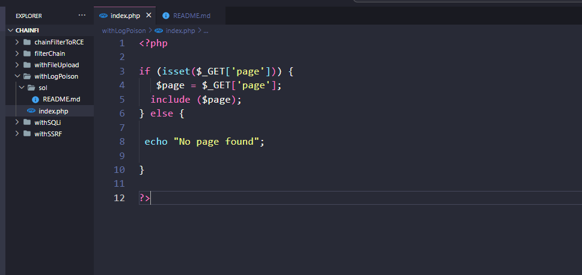
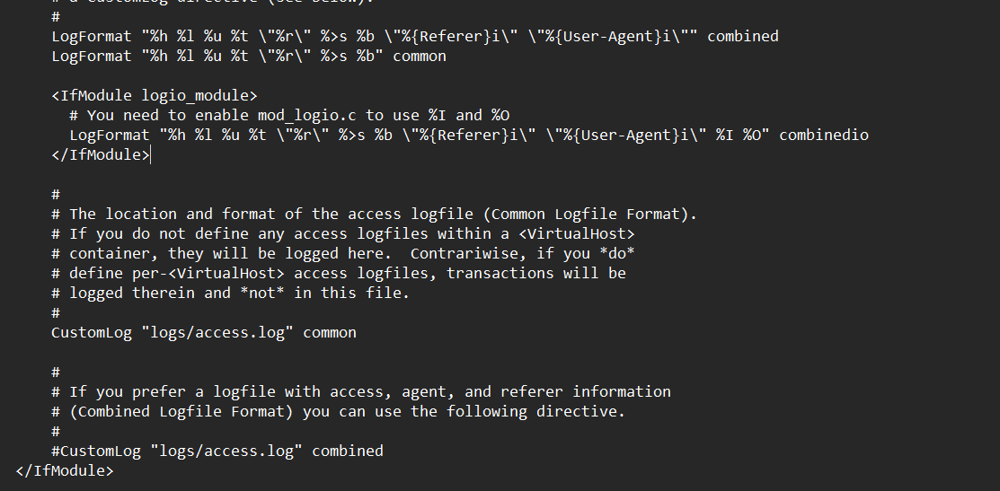
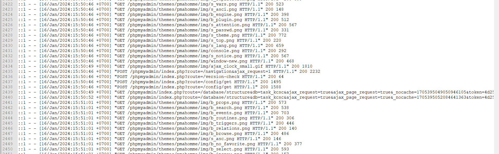
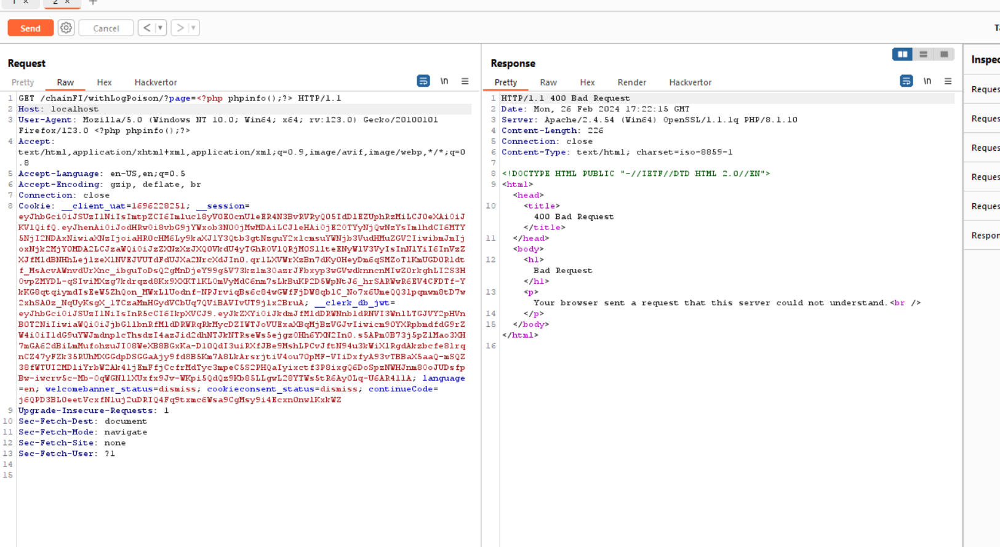
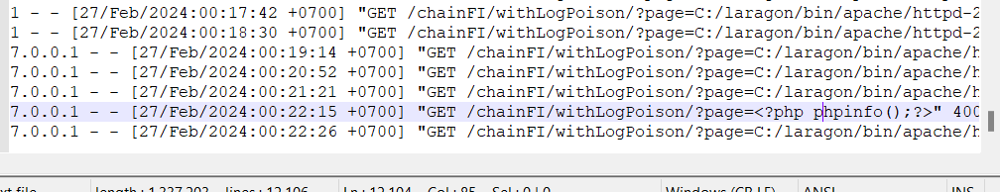
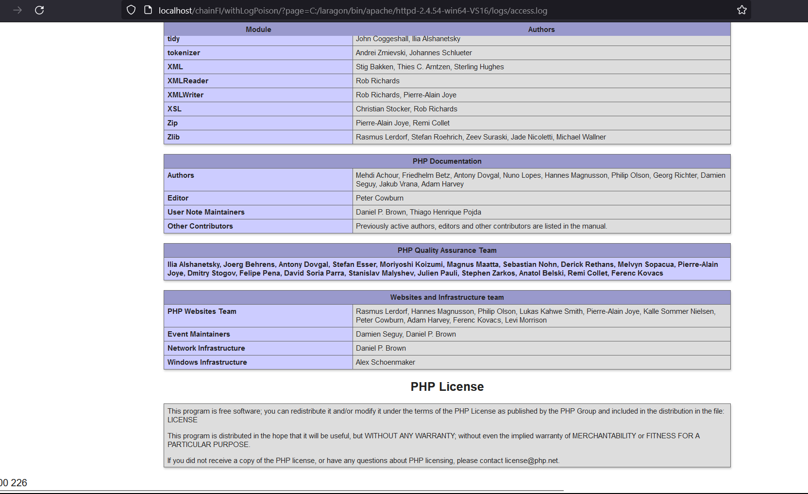

- Đây là một bài sử dụng kĩ thuật Local File inclusion kết hợp với Log poisoning

- Đây là src đơn giản của bài ạ


- Nhận thấy khi mà có một request gửi đến sever thì sẽ có một log sẽ lưu lại với nột dung là HTTP và User-Agent trong file access.log của apache trong sever

- Em sẽ lợi dụng file này kết hợp với path traversal để hiển thị file log này và đặc biệt có một điều kiện là log sẽ không bị encode một vài kí tự đặc biệt như này:
```
   LogFormat "%h %l %u %t \"%r\" %>s %b \"%{Referer}i\" \"%{User-Agent}i\"" combined
    LogFormat "%h %l %u %t \"%r\" %>s %b" common

    <IfModule logio_module>
      # You need to enable mod_logio.c to use %I and %O
      LogFormat "%h %l %u %t \"%r\" %>s %b \"%{Referer}i\" \"%{User-Agent}i\" %I %O" combinedio
    </IfModule>
```
- Và em config lại để cho nó không url encode không thì dùng trên burp luôn được ạ.



- Ban đầu em nghĩ là phải đúng request mới ghi log lên sever nên em định chuyển sang config log với user-agent mà em nhận ra là nếu bad-request cũng có thể ghi log được.
- Bậy giờ em sẽ thay đổi request và nhúng payload:


```

<?php
phpinfo();
?>

```

- Và log đã được chèn vào file access.log

- Sau đó mở file access.log và nhận được kết quả vì ở đây em dùng window nên em sẽ dùng đường dẫn tuyệt đối luôn ạ còn trong linux thì nó nằm trong etc/logs/apache2/access.log

- Em mở LFI lên và dẫn đến file log


- Có một số lưu ý em nhận ra là nếu ta cấu hình apache thì sever còn không cho include file access.log luôn hoặc nếu mà sever không cho thực thi file này cũng không được ạ:<