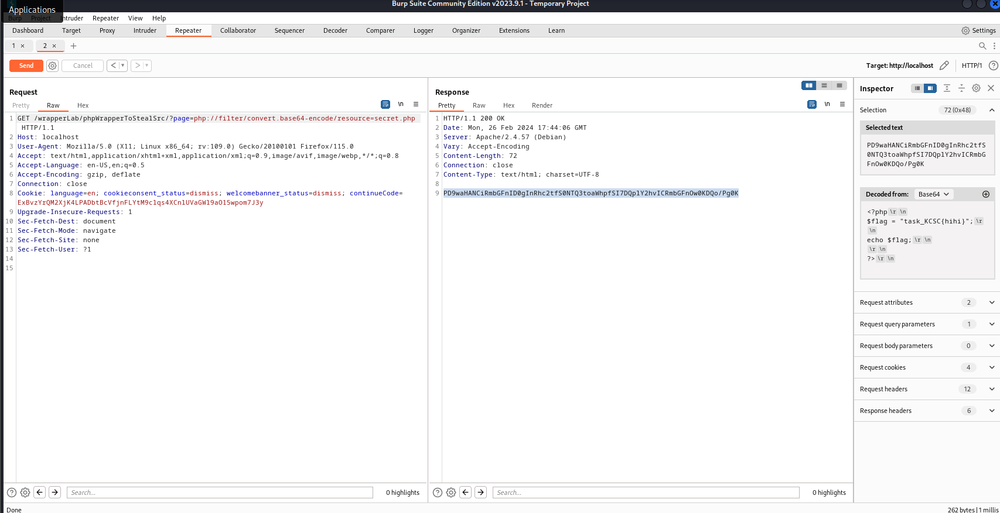

## Cái này em demo vì em thấy có một số page cũng check kiểu này ạ:<

- Bài này cũng tương tự như bài lúc nãy khi mình check nếu có ../ thì sẽ không được

```
<?php

if (isset($_GET['page']) &&  !strpos($_GET['page'], "../")){
  include ($_GET['page']);
} else {
 echo "No page found";

}

?>

```

- Tương tự như dưới thì em dùng:


### Có vẻ khum hợp lí lắm anh ạ:< này em test vui vui thui anh nhá :3