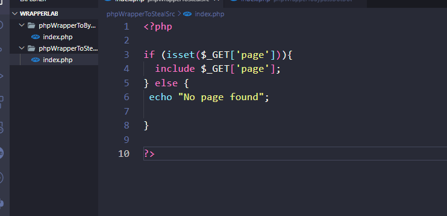
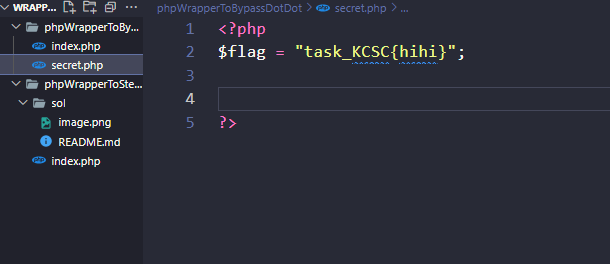
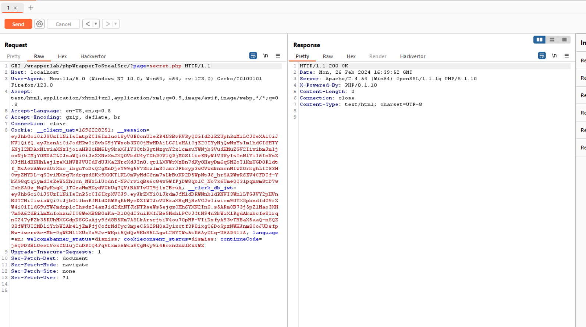
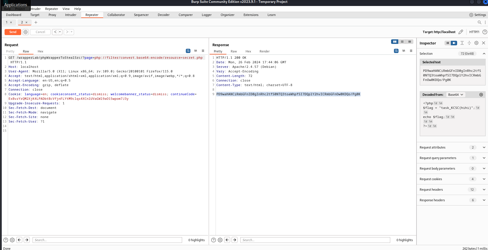

- Đây là một bài em sẽ lợi dụng php wrapper cụ thể là filter wrapper để thực hiện đọc src code của file secret

- Đây sẽ là src của bài khi get parameter page sẽ include file đó vào trong trang web của em 

- Trường hợp này em sẽ cho người dùng biết là em có file secret.php cùng cấp với index.php có nội dung như sau:

- 

- Nếu em include bình thường file secret này vào trang web thì sẽ không hiển thị gì vì trang không có cậu lệnh in ra giá trị nào cả :

- 

- Vì thế cho nên em phải dùng php wrapper convert mã code thành dạng sever không thể thực thi nó

payload :  php://filter/convert.base64-encode/resource=secret.php

- Và kết quả em nhận được là :
